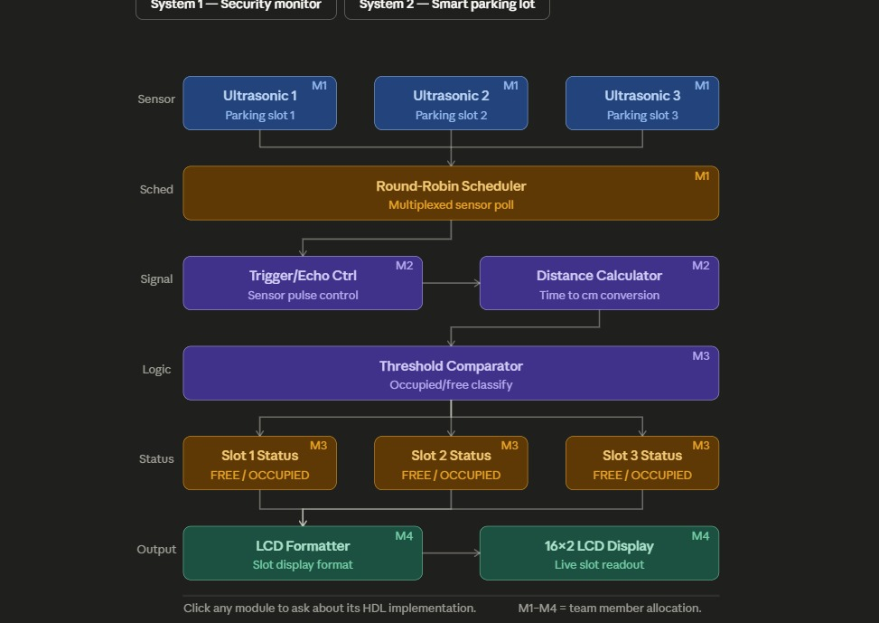

# Smart Parking Lot — HDL Project

A Verilog implementation of a real-time smart parking lot monitor that uses three HC-SR04 ultrasonic sensors to detect vehicle occupancy across three parking slots and displays live status on a 16×2 HD44780 LCD.

---

## Table of Contents

- [System Overview](#system-overview)
- [Architecture](#architecture)
- [Module Reference](#module-reference)
  - [M1 — Round-Robin Scheduler](#m1--round-robin-scheduler)
  - [M2 — Trigger/Echo Control & Distance Calculator](#m2--triggerecho-control--distance-calculator)
  - [M3 — Threshold Comparator](#m3--threshold-comparator)
  - [M4 — LCD Formatter & Display Driver](#m4--lcd-formatter--display-driver)
- [Signal Flow](#signal-flow)
- [File Structure](#file-structure)
- [Simulation & Testbenches](#simulation--testbenches)
- [Timing Parameters](#timing-parameters)
- [LCD Display Format](#lcd-display-format)
- [Team Allocation](#team-allocation)

---

## System Overview

The Smart Parking Lot system monitors three physical parking bays in real time. Each bay is equipped with an HC-SR04 ultrasonic sensor. A central Verilog design running on an FPGA (default: 50 MHz clock) orchestrates sensor polling, distance measurement, occupancy classification, and live LCD output.

The key design challenge is that all three HC-SR04 sensors **cannot** be triggered simultaneously — overlapping echo pulses will corrupt measurements. The system therefore uses a **round-robin scheduler** (M1) to poll one sensor at a time, enforcing strict timing isolation between sensors before passing measurements downstream.

---

## Architecture

```
┌─────────────────────────────────────────────────────────┐
│                     SENSOR LAYER                        │
│  ┌─────────────┐  ┌─────────────┐  ┌─────────────┐     │
│  │ Ultrasonic 1│  │ Ultrasonic 2│  │ Ultrasonic 3│     │
│  │  Parking 1  │  │  Parking 2  │  │  Parking 3  │     │
│  └──────┬──────┘  └──────┬──────┘  └──────┬──────┘     │
│         │  echo_in/trig_out[2:0]           │            │
└─────────┼──────────────────────────────────┼────────────┘
          │                                  │
┌─────────▼──────────────────────────────────▼────────────┐
│  M1 — Round-Robin Scheduler                             │
│  Multiplexed sensor poll (one trigger active at a time) │
│  Outputs: echo_ticks[20:0], slot_id[1:0], valid         │
└─────────────────────────┬───────────────────────────────┘
                          │
┌─────────────────────────▼───────────────────────────────┐
│  M2 — Trigger/Echo Control + Distance Calculator        │
│  Sensor pulse control  →  Time-to-cm conversion         │
│  Outputs: distance_cm[8:0], slot_id[1:0], dist_valid    │
└─────────────────────────┬───────────────────────────────┘
                          │
┌─────────────────────────▼───────────────────────────────┐
│  M3 — Threshold Comparator                              │
│  Occupied / Free classification                         │
│  Outputs: slot_status[2:0]  (1 = occupied, 0 = free)   │
└──────┬──────────────────┬──────────────────┬────────────┘
       │                  │                  │
  Slot 1 Status      Slot 2 Status      Slot 3 Status
  FREE / OCCUPIED    FREE / OCCUPIED    FREE / OCCUPIED
       │
┌──────▼──────────────────────────────────────────────────┐
│  M4 — LCD Formatter + HD44780 16×2 Display Driver       │
│  Slot display format  →  Live slot readout              │
└─────────────────────────────────────────────────────────┘

```

---

## Module Reference

### M1 — Round-Robin Scheduler

**File:** `m1_scheduler_top.v` | **Testbench:** `m1_tb.v`

The scheduler is the architectural heart of the system. It drives all three HC-SR04 sensors sequentially, ensuring echo pulses never overlap.

**FSM States:**

| State | Description |
|-------|-------------|
| `S_IDLE` | De-assert all triggers, clear counters |
| `S_TRIG` | Assert trigger on active sensor for `TRIG_TICKS` (10 µs) |
| `S_WAIT_HI` | Wait for echo rising edge or `ECHO_TIMEOUT` |
| `S_MEASURE` | Count clock ticks while echo is HIGH |
| `S_SETTLE` | Mandatory inter-sensor dead time (10 ms) to prevent acoustic crosstalk |

**Round-robin pointer:** `slot_ptr` cycles `0 → 1 → 2 → 0`.

**Ports:**

| Port | Dir | Width | Description |
|------|-----|-------|-------------|
| `clk` | in | 1 | System clock (50 MHz default) |
| `rst_n` | in | 1 | Active-low asynchronous reset |
| `echo_in` | in | 3 | Echo pins from sensors (bit 0 = slot 1) |
| `trig_out` | out | 3 | Trigger pins to sensors (only one HIGH at a time) |
| `echo_ticks` | out | 21 | Raw echo pulse width in clock ticks |
| `slot_id` | out | 2 | Currently measured slot (0, 1, or 2) |
| `valid` | out | 1 | 1-cycle strobe — latch outputs on this cycle |

**Parameters:**

| Parameter | Default | Real-world Value |
|-----------|---------|-----------------|
| `CLK_FREQ` | 50 000 000 | 50 MHz |
| `TRIG_TICKS` | 500 | 10 µs |
| `ECHO_TIMEOUT` | 1 900 000 | 38 ms |
| `SETTLE_TICKS` | 500 000 | 10 ms |

---

### M2 — Trigger/Echo Control & Distance Calculator

**File:** *(M2 implementation — team member 2)*

M2 receives the raw `echo_ticks` and `slot_id` from M1 and converts the time-of-flight measurement into a distance in centimetres using the HC-SR04 formula:

```
distance_cm = echo_ticks / (CLK_FREQ / 1_000_000) / 58
```

At 50 MHz, one clock tick = 20 ns, so:

```
distance_cm = echo_ticks * 20ns / 58µs_per_cm
            = echo_ticks / 2900   (integer approximation)
```

M2 also handles the trigger pulse generation detail that the HC-SR04 requires a minimum 10 µs HIGH pulse before it begins its ultrasonic burst. This is coordinated with M1's `S_TRIG` state.

**Key outputs to M3:** `distance_cm[8:0]`, `slot_id[1:0]`, `dist_valid`

---

### M3 — Threshold Comparator

**File:** *(M3 implementation — team member 3)*

M3 compares each slot's `distance_cm` value against a configurable threshold to classify the bay as **OCCUPIED** or **FREE**.

```
slot_status[n] = (distance_cm < THRESHOLD_CM) ? 1'b1 : 1'b0
```

A typical threshold for a standard parking bay is **100 cm** (car present = echo shorter than 1 m). M3 maintains a status register for each of the three slots, updating only the slot identified by the incoming `slot_id`.

**Output to M4:** `slot_status[2:0]` — a 3-bit register where bit 0 = slot 1, bit 1 = slot 2, bit 2 = slot 3.

---

### M4 — LCD Formatter & Display Driver

**File:** `m4_lcd_top.v` | **Testbench:** `m4_tb.v`

M4 drives a standard HD44780-compatible 16×2 character LCD in 8-bit parallel mode. It monitors `slot_status` and re-writes the display whenever any bit changes.

**FSM States:**

| State | Description |
|-------|-------------|
| `S_PWRON` | 50 ms power-on delay after reset |
| `S_INIT_SETUP` | Place HD44780 init command on bus |
| `S_INIT_WAIT` | Pulse E high, wait command settle time |
| `S_LATCH` | Capture current `slot_status`, begin frame write |
| `S_ADDR_SETUP` | Send DDRAM address command (0x80 line 1, 0xC0 line 2) |
| `S_ADDR_WAIT` | Pulse E, wait settle |
| `S_DATA_SETUP` | Place ASCII character on data bus (RS=1) |
| `S_DATA_WAIT` | Pulse E, advance character index |
| `S_IDLE` | Monitor `slot_status` for any change |

**Initialisation sequence (HD44780 spec):**

| Step | Command | Hex | Wait |
|------|---------|-----|------|
| 1 | Function Set: 8-bit, 2-line, 5×8 | `0x38` | 40 µs |
| 2 | Function Set (repeat) | `0x38` | 40 µs |
| 3 | Display ON, cursor off | `0x0C` | 40 µs |
| 4 | Clear Display | `0x01` | 1.6 ms |
| 5 | Entry Mode: auto-increment | `0x06` | 40 µs |

**Ports:**

| Port | Dir | Width | Description |
|------|-----|-------|-------------|
| `clk` | in | 1 | System clock |
| `rst_n` | in | 1 | Active-low reset |
| `slot_status` | in | 3 | Occupancy bits from M3 |
| `lcd_rs` | out | 1 | Register Select (0=cmd, 1=data) |
| `lcd_rw` | out | 1 | Read/Write — always LOW |
| `lcd_e` | out | 1 | Enable — pulse to latch byte |
| `lcd_data` | out | 8 | 8-bit data bus (D0–D7) |

**Parameters:**

| Parameter | Default | Real-world Value |
|-----------|---------|-----------------|
| `CLK_FREQ` | 50 000 000 | 50 MHz |
| `T_PWRON` | 2 500 000 | 50 ms |
| `T_EHIGH` | 25 | 500 ns |
| `T_CMD` | 2 000 | 40 µs |
| `T_CLR` | 80 000 | 1.6 ms |

---

## Signal Flow

```
HC-SR04 x3
  │  echo_in[2:0]
  │  trig_out[2:0]
  ▼
M1: m1_scheduler_top
  │  echo_ticks[20:0], slot_id[1:0], valid
  ▼
M2: Trigger/Echo + Distance Calculator
  │  distance_cm[8:0], slot_id[1:0], dist_valid
  ▼
M3: Threshold Comparator
  │  slot_status[2:0]
  ▼
M4: m4_lcd_top
  │  lcd_rs, lcd_rw, lcd_e, lcd_data[7:0]
  ▼
HD44780 16×2 LCD
```

---

## File Structure

```
smart-parking-lot/
├── rtl/
│   ├── m1_scheduler_top.v     # M1: Round-robin scheduler
│   ├── m2_trigger_ctrl.v      # M2: Trigger/echo + distance calc
│   ├── m2_distance_calc.v     # M2: Time-to-cm conversion
│   ├── m3_threshold_cmp.v     # M3: Occupancy classifier
│   └── m4_lcd_top.v           # M4: LCD formatter + HD44780 driver
├── tb/
│   ├── m1_tb.v                # M1 testbench (round-robin + echo models)
│   └── m4_tb.v                # M4 testbench (LCD frame content checker)
├── sim/
│   ├── m1_tb.vcd              # M1 waveform output
│   └── m4_tb.vcd              # M4 waveform output
└── README.md
```

## Timing Parameters

### HC-SR04 Timing Reference

| Measurement | Value | Notes |
|-------------|-------|-------|
| Trigger pulse width | ≥ 10 µs | M1 `TRIG_TICKS = 500` @ 50 MHz |
| Echo pulse range | 150 µs – 25 ms | Proportional to distance |
| Maximum echo timeout | 38 ms | Object out of range or absent |
| Recommended sensor interval | ≥ 60 ms | Avoid acoustic interference |
| Inter-sensor settle (M1) | 10 ms | `SETTLE_TICKS = 500 000` |

### Distance Formula

```
Distance (cm) = Echo pulse duration (µs) / 58
```

At 50 MHz, `echo_ticks` from M1 maps to:

```
distance_cm = echo_ticks / (50 * 58) = echo_ticks / 2900
```

### Full Round-Robin Cycle Time (worst case)

```
3 × (TRIG + ECHO_TIMEOUT + SETTLE)
= 3 × (10 µs + 38 ms + 10 ms)
≈ 144 ms per full poll of all three slots
```

---

## LCD Display Format

The HD44780 16×2 display shows live slot status:

```
┌────────────────┐
│P1:FREE P2:OCC  │  ← Line 1 (DDRAM addr 0x00)
│P3:FREE         │  ← Line 2 (DDRAM addr 0x40)
└────────────────┘
```

Status strings: `FREE` (4 chars, slot empty) · `OCC ` (4 chars with trailing space, slot occupied)

The display is only rewritten when `slot_status` changes, minimising LCD bus traffic.
