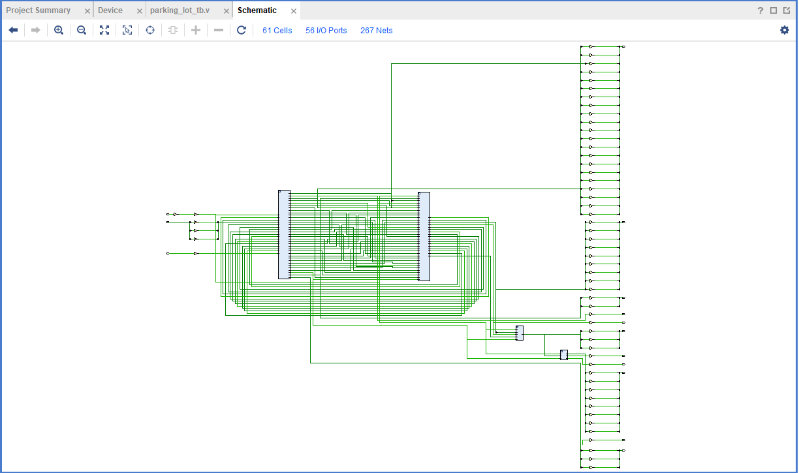

# Smart Parking Lot — HDL Project

A Verilog implementation of a real-time smart parking lot monitor that uses three HC-SR04 ultrasonic sensors to detect vehicle occupancy across three parking slots and displays live status on a 16×2 HD44780 LCD.

---

## Table of Contents

- [System Overview](#system-overview)
- [Architecture](#architecture)
- [Module Reference](#module-reference)
  - [M1 — Round-Robin Scheduler](#m1--round-robin-scheduler)
  - [M2 — Trigger/Echo Control & Distance Calculator](#m2--triggerecho-control--distance-calculator)
  - [M3 — Threshold Comparator](#m3--threshold-comparator)
  - [M4 — LCD Formatter & Display Driver](#m4--lcd-formatter--display-driver)
- [Simulation & Testbenches](#simulation--testbenches)


---

## System Overview

The Smart Parking Lot system monitors three physical parking bays in real time. Each bay is equipped with an HC-SR04 ultrasonic sensor. A central Verilog design running on an FPGA (default: 50 MHz clock) orchestrates sensor polling, distance measurement, occupancy classification, and live LCD output.

The key design challenge is that all three HC-SR04 sensors **cannot** be triggered simultaneously — overlapping echo pulses will corrupt measurements. The system therefore uses a **round-robin scheduler** (M1) to poll one sensor at a time, enforcing strict timing isolation between sensors before passing measurements downstream.

---

## Architecture


The high-level logic and interconnects of the modules are visualized in the schematic below, showing the flow from raw sensor input to the LCD driver.



```
┌─────────────────────────────────────────────────────────┐
│                 SENSOR LAYER                            │
│  ┌─────────────┐  ┌─────────────┐  ┌─────────────┐      │
│  │ Ultrasonic 1│  │ Ultrasonic 2│  │ Ultrasonic 3│      │
│  │  Parking 1  │  │  Parking 2  │  │  Parking 3  │      │
│  └──────┬──────┘  └──────┬──────┘  └──────┬──────┘      │
│         │  echo_in/trig_out[2:0]           │            │
└─────────┼──────────────────────────────────┼────────────┘
          │                                  │
┌─────────▼──────────────────────────────────▼────────────┐
│  M1 — Round-Robin Scheduler                             │
│  Multiplexed sensor poll (one trigger active at a time) │
│  Outputs: echo_ticks[20:0], slot_id[1:0], valid         │
└─────────────────────────┬───────────────────────────────┘
                          │
┌─────────────────────────▼───────────────────────────────┐
│  M2 — Trigger/Echo Control + Distance Calculator         │
│  Sensor pulse control  →  Time-to-cm conversion         │
│  Outputs: distance_cm[8:0], slot_id[1:0], dist_valid    │
└─────────────────────────┬───────────────────────────────┘
                          │
┌─────────────────────────▼───────────────────────────────┐
│  M3 — Threshold Comparator                               │
│  Occupied / Free classification                         │
│  Outputs: slot_status[2:0]  (1 = occupied, 0 = free)    │
└──────┬──────────────────┬──────────────────┬────────────┘
       │                  │                  │
  Slot 1 Status      Slot 2 Status      Slot 3 Status
  FREE / OCCUPIED    FREE / OCCUPIED    FREE / OCCUPIED
       │
┌──────▼──────────────────────────────────────────────────┐
│  M4 — LCD Formatter + HD44780 16×2 Display Driver       │
│  Slot display format  →  Live slot readout              │
└─────────────────────────────────────────────────────────┘
```

---

## Module Reference

### M1 — Round-Robin Scheduler
**File:** `m1_scheduler_top.v` | **Testbench:** `m1_tb.v`

The scheduler is the architectural heart of the system. It drives all three HC-SR04 sensors sequentially, ensuring echo pulses never overlap.

**FSM States:**

| State | Description |
|-------|-------------|
| `S_IDLE` | De-assert all triggers, clear counters |
| `S_TRIG` | Assert trigger on active sensor for `TRIG_TICKS` (10 µs) |
| `S_WAIT_HI` | Wait for echo rising edge or `ECHO_TIMEOUT` |
| `S_MEASURE` | Count clock ticks while echo is HIGH |
| `S_SETTLE` | Mandatory inter-sensor dead time (10 ms) to prevent acoustic crosstalk |

---

### M2 — Trigger/Echo Control & Distance Calculator
**File:** `m2_distance_calc.v`

M2 receives the raw `echo_ticks` and `slot_id` from M1 and converts the time-of-flight measurement into a distance in centimetres.

```
distance_cm = echo_ticks / (CLK_FREQ / 1_000_000) / 58
```

At 50 MHz, one clock tick = 20 ns, so:
```
distance_cm = echo_ticks / 2900   (integer approximation)
```

---

### M3 — Threshold Comparator
**File:** `m3_threshold_cmp.v`

M3 compares each slot's `distance_cm` value against a configurable threshold to classify the bay as **OCCUPIED** or **FREE**. 

---

### M4 — LCD Formatter & Display Driver
**File:** `m4_lcd_top.v` | **Testbench:** `m4_tb.v`

M4 drives a standard HD44780-compatible 16×2 character LCD. It monitors `slot_status` and re-writes the display whenever any bit changes.

---

## Simulation & Testbenches

To verify the logic, the design was simulated using testbenches to ensure the timing of the ultrasonic triggers and the final LCD output were correct.

### Testbench Waveform Output
The following image shows the functional verification of the module outputs:


### Resource Utilization
The synthesis results for the FPGA are summarized here:


---


